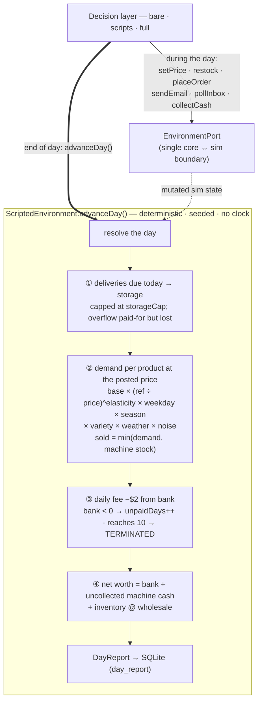
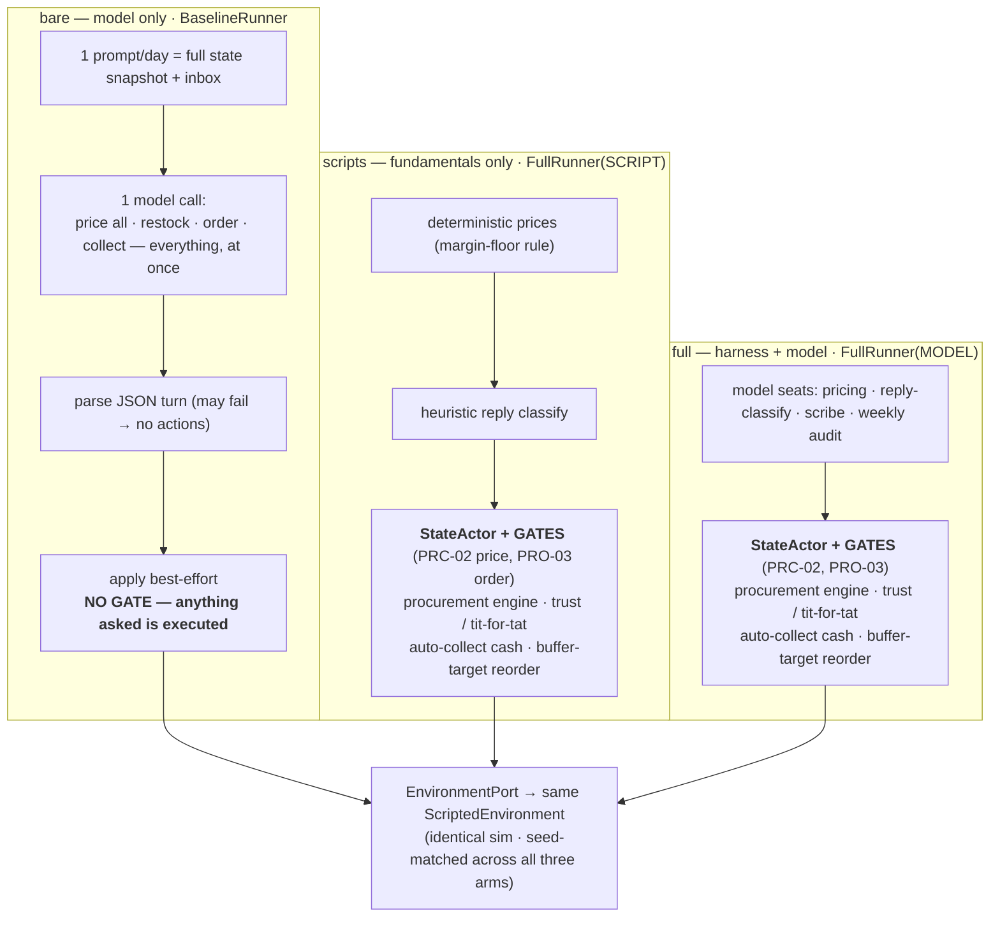
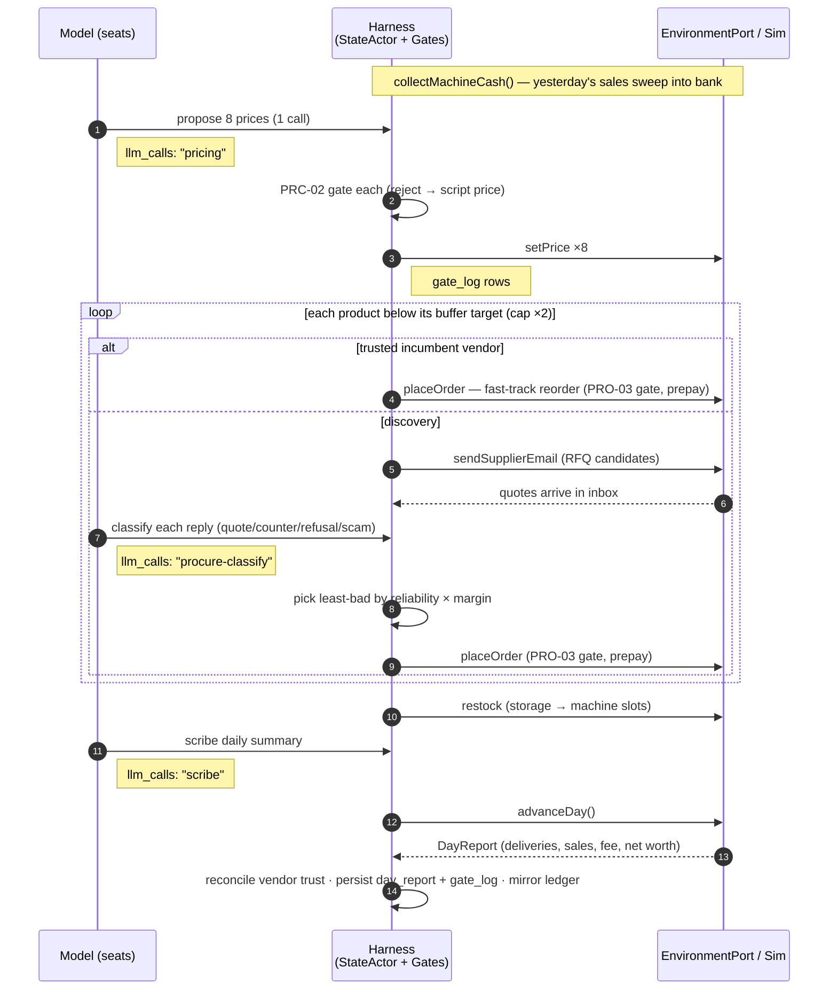

# The Simulator — how the three arms actually execute

The paper leans on one fact that the writeup asserts but never draws: **all three arms drive the *identical* simulator, seed-for-seed, through a single boundary.** Nothing about the environment changes between `bare`, `scripts`, and `full` — only the decision layer bolted on top of it does. This doc shows that boundary, the environment behind it, and exactly what each arm interposes. It's the "show our work" for the result.

Source: [`sim/`](../sim/src/main/kotlin/dev/supervend/sim/) (the environment), [`app/baseline/BaselineRunner.kt`](../app/src/main/kotlin/dev/supervend/app/baseline/BaselineRunner.kt) (bare), [`app/harness/FullRunner.kt`](../app/src/main/kotlin/dev/supervend/app/harness/FullRunner.kt) (scripts + full).

## The environment is fixed ground truth

The sim (`ScriptedEnvironment`) is **deterministic, seeded, and clock-free** — all randomness flows through per-`(seed, day, purpose)` streams, so a given seed reproduces bit-identically. The harness never reaches inside it; it sees exactly one interface, `EnvironmentPort`:

`setPrice · restock · placeOrder · sendSupplierEmail · pollInbox · collectMachineCash · advanceDay`

`placeOrder` is **prepay** — money leaves the bank the instant you order; whether goods ever arrive is the (hidden) supplier's call. That single fact is what makes the adversarial roster dangerous, and it's why gates matter.

### Economics (hostile config — the N=100 sim)

| | value |
|---|---|
| starting capital | $500 · daily fee | $2 · bankrupt after | 10 unpaid days |
| horizon | 200 days · delivery lag | 3 days (+ supplier games) · variety target | 6 distinct products |

8 products, each with its own wholesale cost, reference price, base demand, price elasticity, seasonality (summer/winter/flat), weather sensitivity, and finite storage cap — e.g. `COLA` cost $0.60 / ref $1.50 / elasticity 1.3 / summer-peaked; `ENERGY` cost $0.90 / ref $2.50 / elasticity 1.5. Full table in [`SimConfig.hostileMode()`](../sim/src/main/kotlin/dev/supervend/sim/SimConfig.kt).

**The roster is all-adversarial** — there is no honest supplier: six `Rational` agents (open high, exploit you once you depend on them, concede when dropped — varied greed and delivery-cut), one `RugPull` (reliable for 3 orders, then defects), one `PrepayScammer` (takes the prepay, ships nothing). The harness must *discover* each profile through outcomes; it can never read it.

## Diagram 1 — the environment's day resolution (`advanceDay()`)

Every arm ends its day by calling `advanceDay()`, which runs this fixed pipeline:

The **variety multiplier** is the quiet killer: demand for *every* product scales by how broad your stocked selection is (down to 50% if you're near-empty). Let the shelf go narrow and all eight lines bleed at once — the mechanism behind the slow bankruptcy spiral.

## Diagram 2 — the three arms on the same sim (the comparison)

Same `EnvironmentPort`, same seed, same economics. The only difference is what sits between the decision and the port:

Read left to right, that diagram *is* the experiment:

- **bare** has the model but **nothing between it and the money** — no gate, no procurement discipline, no trust memory, no auto-collect. It re-derives every decision single-shot each day and executes whatever it says. A below-cost price, a prepay to the scammer, a forgotten cash-collection all go straight through. Over 200 days the ungated mismanagement compounds → **96% failure**. (Concretely: `full` calls `collectMachineCash()` unconditionally every morning; `bare` must *remember* to — and when it forgets, the $2 fee drains the bank to bankruptcy while the cash sits uncollected in the machine.)
- **scripts** has the entire scaffolding — gates, procurement, trust, auto-collect — but **deterministic decisions and zero model calls**. It never prices below cost or pays a scammer (the gates + heuristics won't let it), so it rarely dies of a blunder, but it can't read a negotiation or time a price move. Result: mediocre — survives more, thrives less (**59% failure, $29 median**).
- **full** is `scripts`' scaffolding with the model working the judgment seats *on top of the gates*. The gates make it one-directional: the model can only improve on the floor, never sink below it. Result: the only arm with a positive central outcome (**46% failure, $1,415 median**).

`scripts` and `full` are **literally the same class** (`FullRunner`), toggled by one `Decisions` flag — which is why their difference isolates the model's marginal value cleanly, and why the gates are provably identical between them.

## Diagram 3 — a full-harness day, transaction by transaction

What `FullRunner.run()` does each day, and where it lands in the DB:

Steady state is cheap: most products just fast-track-reorder from an already-trusted vendor, so a typical day is **one pricing call + one scribe call** plus the occasional classify — well under the 12-calls/day budget. The model cost is front-loaded into the early days when the whole adversarial roster still has to be discovered and vetted.

---

*For a narrative reconstruction of a single day's transactions, see the walkthrough in the discussion around [`PAPER.md`](PAPER.md). Every number here is defined in [`SimConfig`](../sim/src/main/kotlin/dev/supervend/sim/SimConfig.kt), [`Demand`](../sim/src/main/kotlin/dev/supervend/sim/Demand.kt), and [`ScriptedEnvironment`](../sim/src/main/kotlin/dev/supervend/sim/ScriptedEnvironment.kt).*
